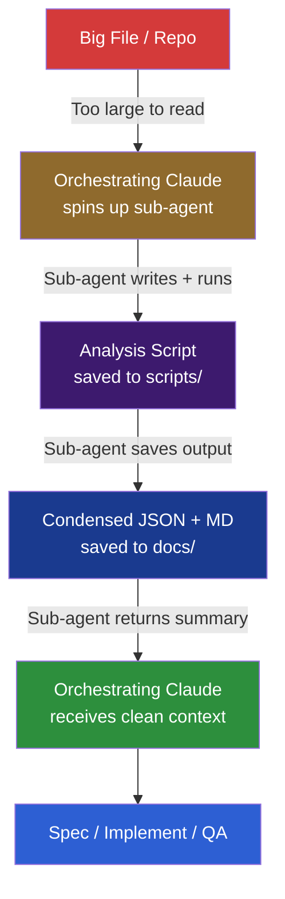

# Large Context Strategy

When a file, directory, or repo is too large to fit in the model's context window — **don't guess, don't skip, don't summarize blindly.** Write a script to extract the signal first.

## The Problem

Large codebases break the spec-driven workflow in a specific way: the agent can't read what it needs to understand before building. Symptoms:
- Files over ~500 lines where only part is relevant
- Repos with hundreds of files where the shape/structure is unknown
- SQL codebases with hundreds of procedures or functions
- Any situation where "read the code" is not a viable first step

## The Solution: Sub-agent → Analyze → Condense → Act

This is a **sub-agent pattern**, not a hook. A hook can advise or block — it cannot write a script, run it, and return condensed output. The orchestrating Claude spins up a sub-agent with isolated context to do the analysis work. The main agent gets a clean, condensed summary back — its context window stays healthy.



## When to Trigger This Strategy

| Signal | Action |
|--------|--------|
| Single file > 500 lines and only part is relevant | Write a targeted extraction script |
| Repo has 50+ files relevant to the task | Write a repo shape/inventory script |
| SQL database with unknown schema count | Write a schema/function counter script |
| "I need to understand the structure before I can spec this" | Write a structure analysis script |
| Previous attempt failed because of missing context from a large file | Write a focused extraction script |

**Default threshold:** If you estimate you'd need to read more than ~10 files or ~2,000 lines to understand the shape of the problem, write a script first.

---

## Workflow

### Step 1: Assess the Scope

Before writing any script, state what you're trying to understand:

```
## Context Assessment

### What I need to know
- [Question 1: e.g., "How many stored procedures exist and which schemas do they belong to?"]
- [Question 2: e.g., "What are the largest files and what do they contain?"]

### Why I can't read it directly
- [e.g., "The target directory has 400+ files — reading each one would exhaust context"]

### What the script will extract
- [e.g., "File counts by schema family, function names, line counts per file"]

### Script language
- [ ] Python (default — best for structured output, JSON, cross-platform)
- [ ] Bash (best for simple file system operations on Unix/Mac)
- [ ] PowerShell (best for Windows environments)
- [ ] Node.js (best when the codebase is JS/TS and node_modules is available)
```

Ask the engineer: **"What language should I use for the analysis script? Default is Python."**

### Step 2: Write the Script

Scripts follow this structure:

```python
#!/usr/bin/env python3
"""
[TICKET-XXX] — [What this script does]
Purpose: [Why we need this — what question it answers]
Output:
  - scripts/[ticket]-analysis.py  (this file)
  - docs/[ticket]-analysis.json   (machine-readable results)
  - docs/[ticket]-analysis.md     (human-readable report)
"""

import os
import json
# ... imports

TARGET_DIR = "[path to analyze]"
OUTPUT_JSON = "docs/[ticket]-analysis.json"
OUTPUT_MD   = "docs/[ticket]-analysis.md"

def analyze():
    results = {}
    # ... analysis logic
    return results

def write_json(results):
    with open(OUTPUT_JSON, 'w') as f:
        json.dump(results, f, indent=2)
    print(f"JSON saved: {OUTPUT_JSON}")

def write_md(results):
    lines = [
        f"# Analysis: [TICKET-XXX] — [Title]",
        f"",
        f"**Generated:** [timestamp]",
        f"**Target:** {TARGET_DIR}",
        f"",
        # ... formatted report sections
    ]
    with open(OUTPUT_MD, 'w') as f:
        f.write('\n'.join(lines))
    print(f"Report saved: {OUTPUT_MD}")

if __name__ == "__main__":
    results = analyze()
    write_json(results)
    write_md(results)
    print("Done.")
```

### Step 3: Save the Script

Save to `scripts/TICKET-XXX-analysis.[py|sh|ps1|js]` in the repo.

**Naming convention:**
- `scripts/TASK-123-repo-shape.py` — repo inventory
- `scripts/TASK-123-schema-map.py` — database schema analysis
- `scripts/TASK-123-function-count.sh` — file/function counter
- `scripts/TASK-123-extract-patterns.py` — pattern extraction

### Step 4: Run It

```bash
python scripts/TASK-123-analysis.py
# or
bash scripts/TASK-123-function-count.sh
```

### Step 5: Read the Output

Read `docs/TASK-123-analysis.md` and `docs/TASK-123-analysis.json`. These now fit in context. Use them to:
- Understand the shape of the problem
- Add to the spec's Technical Constraints section
- Inform the "Files to Change" table
- Identify blast radius

---

## Common Script Types

### Repo Shape / Inventory

Answers: "What's in this repo? How big is it? Where's the relevant code?"

Outputs:
- File count by extension
- Directory tree (depth 3)
- Largest files by line count
- Files matching a pattern (e.g., `*Controller*`, `*Service*`)

### Schema / Database Analysis

Answers: "How many stored procedures? Which schemas? What's the naming pattern?"

Outputs:
- Object counts by type (SP, function, table, view)
- Grouping by schema family
- Top N by size or complexity

### Pattern / Dependency Extraction

Answers: "Where is this function/class/interface used? What depends on what?"

Outputs:
- Usage map (where X is imported/called)
- Dependency graph (JSON edge list)
- Coupling score by module

### Targeted File Extraction

Answers: "I need the relevant 200 lines from this 2,000 line file."

Outputs:
- Extracted functions/methods matching a pattern
- Section of file between named markers
- All occurrences of a pattern with surrounding context

---

## Output Conventions

| Output Type | Location | Format |
|-------------|----------|--------|
| Analysis script | `scripts/TICKET-XXX-[description].[ext]` | .py / .sh / .ps1 / .js |
| Machine-readable results | `docs/TICKET-XXX-[description].json` | JSON |
| Human-readable report | `docs/TICKET-XXX-[description].md` | Markdown with tables |
| Heat maps / visualizations | `docs/TICKET-XXX-[description].html` | Optional, for complex visual output |

---

## Rules

- **Write the script before reading files manually.** If the scope triggers the threshold, don't try to "just read a few files first."
- **Always save both JSON and MD.** JSON for machine use (follow-up scripts, QA agent), MD for human review and spec inclusion.
- **Scripts are artifacts.** They stay in the repo. Future engineers (and agents) can re-run them as the codebase evolves.
- **Ask about script language first.** Default Python, but ask — a Windows-only team may need PowerShell, a Node shop may prefer JS.
- **The report feeds the spec.** Key findings go into the spec's Technical Constraints and Risks sections. Don't keep them separate.
